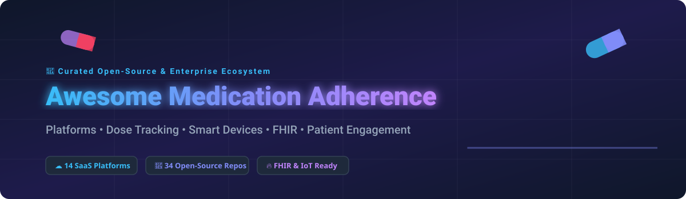

<div align="center">



# 💊 Awesome Medication Adherence Platform

### 🚀 Comprehensive Ecosystem of SaaS Platforms, Smart Medication Devices, Open-Source Repositories & FHIR Digital Health Infrastructure

<a href="https://github.com/ishandutta2007/Awesome-Awesome-Awesome"></a><a href="https://discord.gg/jc4xtF58Ve"></a> [](https://github.com/ishandutta2007/Awesome-Awesome-Awesome) [](https://opensource.org/licenses/MIT) [](http://makeapullrequest.com) <a href="https://github.com/ishandutta2007"></a>

**Focus:** 💊 Medication Adherence | ⏰ Medication Reminders | 📊 Dose Tracking | 🏥 Healthcare Interoperability (FHIR) | 📲 Patient Engagement | 🤖 Digital Therapeutics | 🩺 Care Management | 📟 Smart Medication Devices & Pill Dispensers | 📹 Directly Observed Therapy (DOT) | 📦 Refill Management | 📈 Adherence Analytics

**Last Updated:** September 2026

</div>

---

## 📋 Table of Contents

* [Overview](#-overview)
* [SaaS/Hosted Platforms](#-saashosted-platforms)
* [Open-Source](#-open-source)
  * [Complete Medication Management Platforms](#1-complete-medication-management-platforms)
  * [Medication Reminder & Adherence Apps](#2-medication-reminder--adherence-apps)
  * [Self-Hosted Medication Tracking](#3-self-hosted-medication-tracking)
  * [Caregiver & Multi-Patient Management](#4-caregiver--multi-patient-management)
  * [Medication Inventory & Refill Management](#5-medication-inventory--refill-management)
  * [Health Records & Personal Health Management](#6-health-records--personal-health-management)
  * [FHIR & Healthcare Interoperability](#7-fhir--healthcare-interoperability)

  * [Digital Health & Patient Engagement](#8-digital-health--patient-engagement)
  * [Notifications & Reminders](#9-notifications--reminders)
  * [Scheduling & Care Coordination](#10-scheduling--care-coordination)
  * [Analytics & Reporting](#11-analytics--reporting)
  * [Authentication & Security](#12-authentication--security)
* [Commercial → Open-Source Mapping](#-commercial--open-source-mapping)
* [Medication Adherence Capability Matrix](#-medication-adherence-capability-matrix)
* [Recommended Open-Source Architecture](#-recommended-open-source-architecture)
* [Best Open-Source Combinations](#-best-open-source-combinations)
* [Medication Adherence Lifecycle](#-medication-adherence-lifecycle)
* [What Open Source Can Replace](#-what-open-source-can-replace)
* [What Open Source Does Not Automatically Replace](#-what-open-source-does-not-automatically-replace)
* [Suggested Open-Source Technology Stack](#-suggested-open-source-technology-stack)
* [Example Adherence Flow](#-example-adherence-flow)
* [Smart Medication Device Architecture](#-smart-medication-device-architecture)
* [Privacy & Security](#-privacy--security)
* [Healthcare Interoperability](#-healthcare-interoperability)
* [Adherence Analytics](#-adherence-analytics)
* [AI & Intelligent Adherence](#-ai--intelligent-adherence)
* [Open-Source Maturity](#-open-source-maturity)
* [Key Takeaway](#-key-takeaway)
* [How to Contribute](#-how-to-contribute)
* [Disclaimer](#-disclaimer)

---

# 🔎 Overview

Medication adherence platforms help patients, caregivers, healthcare organizations, pharmaceutical companies and clinical-trial teams manage and measure whether medications are taken according to an intended treatment plan.

The ecosystem ranges from simple medication-reminder applications to sophisticated systems combining:

* Medication reminders
* Dose confirmation
* Medication schedules
* Adherence history
* Refill management
* Inventory tracking
* Caregiver alerts
* Patient engagement
* Digital health coaching
* Care management
* Treatment-plan tracking
* Directly Observed Therapy (DOT)
* Video-based adherence verification
* Smart pill bottles
* Smart bottle caps
* Smart medication dispensers
* Clinical-trial adherence
* Patient-reported outcomes
* Device telemetry
* Behavioral interventions
* Adherence analytics
* Risk identification
* Provider dashboards
* Pharmaceutical patient-support programs

Commercial platforms such as Medisafe, PatchRx, Wellth, Scene Health, AdhereTech, Perx Health and Spencer Health Solutions illustrate the range from consumer medication management to connected-device and enterprise patient-engagement solutions. Medisafe, for example, currently describes an enterprise engagement platform combining personalized journeys, reminders, analytics and omnichannel communication; PatchRx uses connected smart bottle caps and provider-facing adherence data; Scene uses asynchronous video-based directly observed therapy; AdhereTech combines connected smart bottles/caps with intervention; and Spencer uses a connected medication dispenser.

```text
                  MEDICATION ADHERENCE
                           │
          ┌────────────────┴────────────────┐
          │                                 │
   SaaS / Hosted                      Open Source
          │                                 │
   ┌──────┼─────────┐              ┌────────┼──────────┐
   │      │         │              │        │          │
Reminder Device   Care         Tracking   FHIR      Analytics
   │      │       Management       │        │          │
Medisafe PatchRx Wellth       MedTimer  HAPI FHIR   Metabase
Perx     AdhereTech Scene      MedAssist OpenEMR     Superset
```

---

# ☁️ SaaS/Hosted Platforms

> **📊 Market Size & Market Structure:**
> The global medication adherence market size is estimated at **\$4.2 Billion (2026)** and is projected to reach **\$8.5 Billion by 2030** (CAGR ~15.2%). The sector is **moderately fragmented**, featuring specialized enterprise digital therapeutics (Medisafe, Scene Health), connected hardware providers (Hero, AdhereTech, Spencer), and broad remote patient monitoring platforms competing alongside niche consumer apps.

| SaaS Platform | Company Size (Valuation / Funding / Revenue) 📈 | Pricing 💰 | Free Tier Limit 🎁 | Key Focus / Target Segment | Website 🌐 |
| :--- | :--- | :--- | :--- | :--- | :--- |
| **Hero Health** | ~$450M Valuation ($100M+ Raised) | $34.99/mo (Smart Dispenser + App) | 30-Day Money-Back Guarantee Trial | Connected Smart Dispenser & Medication Management | [Website](https://herohealth.com/) |
| **Scene Health** (emocha) | $60M+ Funding ($15M+ Rev) | $50/patient/mo | 14-Day Enterprise Demo / Pilot Access | Asynchronous Video Directly Observed Therapy (DOT) | [Website](https://www.scene.health/) |
| **Medisafe** | ~$50M Valuation ($31.5M Funding) | $4.99/mo (Medisafe Premium) | Free-Forever Plan (Unlimited Reminders & Basic Tracking) | Mobile Medication Reminders & Pharma Patient Support | [Website](https://medisafe.com/) |
| **Wellth** | $40M+ Funding ($10M+ Rev) | $15/member/mo (B2B Health Plans) | 30-Day Health Plan Pilot Program | Daily Incentive & Behavioral Verification Platform | [Website](https://www.wellthapp.com/) |
| **AdhereTech** | $35M+ Funding ($10M+ Rev) | $25/patient/mo | 30-Day Clinical Trial / Pharma Pilot | Aidia Connected Smart Pill Bottles & Caps | [Website](https://adheretech.com/) |
| **Spencer Health Solutions** | $30M+ Funding | $45/patient/mo | 30-Day Clinical Trial Pilot Access | Connected Smart Dispenser & Clinical Trials Platform | [Website](https://spencerhealthsolutions.com/) |
| **MedMinder** | $25M+ Funding | $69.99/mo (Includes Automated Dispenser) | 30-Day Trial Period | Connected Pill Dispenser & Pharmacy Services | [Website](https://www.medminder.com/) |
| **PatchRx** | $15M+ Valuation ($8M Funding) | $20/patient/mo | 14-Day Provider Demo Account | Smart Pill Bottle Caps & Provider RPM Dashboards | [Website](https://www.patchrx.io/) |
| **Perx Health** | $7M+ Funding | $10/member/mo | 14-Day Health Plan Demo | Gamified Chronic Disease Adherence & Engagement | [Website](https://www.perxhealth.com/) |
| **CareClinic** | ~$5M Valuation (~$2M Rev) | $9.99/mo (CareClinic Premium) | 7-Day Free Trial (Basic Symptom & Dose Log) | Personal Health Journal & Caregiver Medication Tracker | [Website](https://careclinic.io/) |
| **MyTherapy** | ~$5M Valuation (~$3M Rev) | $4.99/mo (MyTherapy Plus) | Free-Forever Plan (Ad-Free Medication Reminders) | Consumer Pill Reminder & Health Measurement App | [Website](https://www.mytherapyapp.com/) |
| **MyMeds** | ~$4M Valuation ($2M Funding) | $5/user/mo | 14-Day Enterprise Demo Access | Digital Prescription Management & Adherence Engagement | [Website](https://www.mymeds.com/) |
| **Mango Health** | Acquired by TrialSpark (~$3M) | Free (App-based) | Free-Forever Plan (Health Habits & Pill Reminders) | Gamified Medication Reminders & Rewards | [Website](https://www.mangohealth.com/) |
| **Pillo Health** | Acquired by Stanley Black & Decker | $299 Hardware + $19.99/mo | 30-Day Product Warranty / Guarantee | Voice-Activated Personal Health Assistant & Dispenser | [Website](https://pillohealth.com/) |

---


# 🧩 Open-Source

> **Important:** The open-source medication-adherence ecosystem is much more fragmented than the commercial market.

> There is no single mature open-source platform that reproduces the full combination of **Medisafe + PatchRx + Wellth + Scene Health + AdhereTech + Perx + Spencer**.

Commercial products frequently combine proprietary hardware, mobile applications, behavioral-science programs, clinical workflows, regulated healthcare infrastructure, device telemetry and enterprise services.

Open-source projects are strongest in:

* Medication tracking
* Medication reminders
* Dose history
* Inventory management
* Self-hosting
* Personal health records
* FHIR interoperability
* Notifications
* Caregiver coordination
* Analytics
* Application development

---

# 1. Complete Medication Management Platforms

## MedAssist-ng

**GitHub:** https://github.com/DanielVolz/medassist-ng

A modern open-source, self-hosted medication tracking and planning application.

**Key Capabilities:**

* Medication management
* Flexible schedules
* Dose history
* Inventory tracking
* Refill management
* Stock alerts
* Medication reports
* Multi-person support
* Shared schedules
* JSON export/import
* Medication lookup
* RxNorm integration
* openFDA integration
* EMA integration
* Push notifications
* Email notifications
* OIDC authentication
* Docker deployment

The current repository describes MedAssist-ng as fully self-hosted and supporting stock monitoring, schedules, reminders, multi-person management, sharing, reports and multiple notification channels.

**License:** MIT

---

## MedAssist

**GitHub:** https://github.com/njic/medassist

Self-hosted medication-management application.

**Key Capabilities:**

* Medication inventory
* Refill reminders
* Medication schedules
* Dashboard
* Travel medication planning
* Email notifications
* SQLite
* Docker deployment

The project describes itself as self-hosted medication-management software and includes medication inventory, reorder reminders and travel planning.

**License:** GPL-3.0

---

## MedTracker

**GitHub:** https://github.com/damacus/med-tracker

Open-source self-hosted medication tracker designed for individuals, families and carers.

**Key Capabilities:**

* Household medication schedules
* Dose recording
* Stock tracking
* Reminders
* Auditable history
* Multi-person management
* Caregiver coordination
* Self-hosting
* CLI
* MCP server

The project currently describes itself as a self-hosted beta and specifically supports shared household medication management and attributable dose records.

---

# 2. Medication Reminder & Adherence Apps

## MedTimer

**GitHub:** https://github.com/Futsch1/medTimer

Open-source Android medication-reminder and history application.

**Key Capabilities:**

* Unlimited medications
* Custom reminders
* Flexible schedules
* Snooze
* Interval reminders
* Dose confirmation
* Adherence history
* Calendar history
* CSV export
* JSON backup
* Stock tracking
* Expiration reminders
* Offline operation
* Privacy-focused architecture

MedTimer offers FOSS and Google-Play-services variants and stores medication information locally for offline use.

**License:** MIT

---

## MediTrak

**GitHub:** https://github.com/AdamGuidarini/MediTrak

Free and open-source Android medication-tracking application.

**Key Capabilities:**

* Multiple patients
* Medication schedules
* Flexible reminders
* Dose tracking
* Medication notes
* Adverse-effect notes
* Local data storage
* Notifications
* SQLite

The repository describes MediTrak as an Android medication-tracking application with local data storage and support for multiple patients.

**License:** GPL-2.0

---

## PillApp

**GitHub:** https://github.com/Qitalach/PillApp

Open-source Android pill-reminder application.

**Key Capabilities:**

* Medication records
* Multiple alarms
* Daily schedules
* Weekly schedules
* Dose confirmation
* Snooze
* Skipped-dose recording
* Medication history

The project explicitly supports responses such as "I took it", "Snooze" and "I won't take it", making it useful as a basic adherence-tracking reference implementation.

---

## TakeYourMeds

**GitHub:** https://github.com/cucumberfalse/takeyourmeds

Offline-first Flutter medication-reminder application.

**Key Capabilities:**

* Medication reminders
* Flexible schedules
* Local notifications
* Intake journal
* Offline-first operation
* Mobile application

The project appears in GitHub's current medication-tracker ecosystem.

---

## Pilldor

**GitHub:** https://github.com/manuel-array/pilldor

Medication reminder and intake-tracking application for iOS.

**Key Capabilities:**

* Medication schedules
* Local reminders
* Dose logging
* Calendar history
* On-device operation
* No advertising tracking

---

# 3. Self-Hosted Medication Tracking

## HealthLog

**GitHub:** https://github.com/MBombeck/HealthLog

Self-hosted privacy-focused personal health-tracking platform.

**Potential Medication Use:**

* Medication tracking
* Health metrics
* Blood pressure
* Glucose
* Sleep
* Mood
* Personal health history
* Health-device integrations

The project is listed in the current medication-tracker ecosystem as a self-hosted health PWA with medication and other health tracking.

---

## MedAssist-ng

https://github.com/DanielVolz/medassist-ng

Particularly suitable for:

* Self-hosted medication management
* Household medication tracking
* Refill management
* Medication schedules
* Notifications

---

## MedTracker

https://github.com/damacus/med-tracker

Particularly suitable for:

* Families
* Carers
* Multi-person medication tracking
* Dose history
* Shared medication schedules

---

# 4. Caregiver & Multi-Patient Management

Medication adherence often involves more than the patient.

```text
                    CARE NETWORK
                         │
          ┌──────────────┼──────────────┐
          │              │              │
          ▼              ▼              ▼
       Patient        Caregiver       Clinician
          │              │              │
          └──────────────┼──────────────┘
                         ▼
                  Medication Plan
                         │
                         ▼
                   Dose Tracking
                         │
                         ▼
                    Adherence
                         │
                         ▼
                     Alerts
```

Useful open-source starting points:

* MedAssist-ng
* MedTracker
* MediTrak
* HealthLog
* FHIR-based platforms
* OpenEMR
* GNU Health

---

# 5. Medication Inventory & Refill Management

Medication adherence is affected not only by remembering doses but also by medication availability.

Useful open-source projects:

### MedAssist-ng

https://github.com/DanielVolz/medassist-ng

Supports:

* Stock levels
* Package-aware inventory
* Days of supply
* Refill history
* Reorder reminders
* Trip planning

---

### MedAssist

https://github.com/njic/medassist

Supports:

* Medication inventory
* Reorder alerts
* Travel medication lists

---

### MedTracker

https://github.com/damacus/med-tracker

Supports:

* Stock tracking
* Low-stock awareness
* Shared household medication management

---

# 6. Health Records & Personal Health Management

## OpenEMR

**GitHub:** https://github.com/openemr/openemr

Open-source electronic health record and practice-management platform.

**Potential Adherence Integration:**

* Medication lists
* Patient records
* Care plans
* Clinical workflows
* Provider access
* Patient portal
* Clinical documentation

---

## GNU Health

**GitHub:** https://github.com/gnuhealth/gnuhealth

Open-source health and hospital information system.

Potentially useful for:

* Medication records
* Patient management
* Clinical workflows
* Healthcare analytics
* Longitudinal records

---

## OpenMRS

**GitHub:** https://github.com/openmrs/openmrs-core

Open-source medical-record platform.

Potential use:

* Medication orders
* Patient records
* Treatment plans
* Clinical workflows
* Adherence data integration

---

## Bahmni

**GitHub:** https://github.com/Bahmni/bahmni

Open-source hospital information system built around OpenMRS and related technologies.

Potential use:

* Medication records
* Clinical workflows
* Pharmacy
* Patient management
* Care coordination

---

# 7. FHIR & Healthcare Interoperability

## HAPI FHIR

**GitHub:** https://github.com/hapifhir/hapi-fhir

Open-source FHIR implementation for healthcare interoperability.

Useful for exchanging:

* Patient
* Medication
* MedicationRequest
* MedicationStatement / MedicationUsage
* Observation
* CarePlan
* Task
* Questionnaire
* QuestionnaireResponse

---

## Firely Server

**GitHub:** https://github.com/FirelyTeam/firely-net-sdk

FHIR ecosystem and .NET tooling useful for interoperability.

---

## Medplum

**GitHub:** https://github.com/medplum/medplum

Open-source healthcare developer platform built around FHIR.

**Potential Adherence Use Cases:**

* Patient records
* Medication resources
* Care plans
* Patient portals
* Clinical workflows
* Healthcare applications
* FHIR APIs

---

## Open Health Stack

**GitHub:** https://github.com/google/open-health-stack

Open-source building blocks for digital health applications.

Potential use:

* Health workflows
* Offline-first applications
* FHIR
* Clinical decision support
* Community health

---

# 8. Digital Health & Patient Engagement

## Open Health Stack

https://github.com/google/open-health-stack

Useful for building:

* Patient applications
* Community health applications
* Offline-first health applications
* FHIR-enabled health workflows

---

## OpenMRS

https://github.com/openmrs/openmrs-core

Useful for integrating adherence into clinical systems.

---

## OpenEMR

https://github.com/openemr/openemr

Useful for provider-facing medication and patient-management workflows.

---

## GNU Health

https://github.com/gnuhealth/gnuhealth

Useful for broader longitudinal healthcare applications.

---

# 9. Notifications & Reminders

A medication-adherence platform requires reliable notification infrastructure.

## ntfy

**GitHub:** https://github.com/binwiederhier/ntfy

Simple self-hostable notification service.

Useful for:

* Dose reminders
* Refill alerts
* Caregiver notifications
* Low-stock notifications

---

## Gotify

**GitHub:** https://github.com/gotify/server

Self-hosted push-notification server.

---

## Novu

**GitHub:** https://github.com/novuhq/novu

Open-source notification infrastructure.

Supports:

* Push
* Email
* SMS integrations
* In-app notifications
* Notification workflows
* Templates

---

## Apprise

**GitHub:** https://github.com/caronc/apprise

Notification library supporting many notification services.

Useful for:

* Medication alerts
* Caregiver notifications
* Refill notifications
* System alerts

---

# 10. Scheduling & Care Coordination

## Cal.com

**GitHub:** https://github.com/calcom/cal.com

Open-source scheduling platform.

Potential uses:

* Medication-review appointments
* Care-manager calls
* Pharmacist consultations
* Patient follow-ups
* Clinical-trial visits

---

## Nextcloud Calendar

**GitHub:** https://github.com/nextcloud/calendar

Useful for:

* Medication schedules
* Care appointments
* Refill dates
* Clinical follow-ups

---

## Nextcloud

**GitHub:** https://github.com/nextcloud/server

Useful as a self-hosted collaboration and document-sharing layer for healthcare projects.

---

# 11. Analytics & Reporting

## Metabase

**GitHub:** https://github.com/metabase/metabase

Useful for adherence dashboards.

Potential KPIs:

* Dose adherence
* Missed doses
* Late doses
* Refill gaps
* Persistence
* Patient engagement
* Program enrollment
* Caregiver interventions

---

## Apache Superset

**GitHub:** https://github.com/apache/superset

Useful for:

* Enterprise adherence analytics
* Cohort analysis
* Clinical-program reporting
* Population dashboards

---

## Grafana

**GitHub:** https://github.com/grafana/grafana

Useful for:

* Device telemetry
* Smart dispenser monitoring
* Real-time adherence signals
* Operational monitoring

---

# 12. Authentication & Security

## Keycloak

**GitHub:** https://github.com/keycloak/keycloak

Useful for:

* Patient authentication
* Caregiver accounts
* Clinician accounts
* SSO
* OIDC
* RBAC

---

## OpenFGA

**GitHub:** https://github.com/openfga/openfga

Useful for fine-grained authorization:

```text
Patient
  │
  ├── Own medication data
  │
  ├── Share with caregiver
  │
  └── Share selected data with clinician
```

---

## OpenBao

**GitHub:** https://github.com/openbao/openbao

Open-source secrets-management platform.

Useful for:

* API credentials
* Healthcare integrations
* Encryption keys
* Device credentials

---

# 🧱 Additional Strong Open-Source Options

| Project | Stars ⭐ | Primary Role | Adherence Relevance |
| :--- | :---: | :--- | :---: |
| [Home Assistant Core](https://github.com/home-assistant/core) | [](https://github.com/home-assistant/core/stargazers) | Smart Home / Sensor Telemetry | ⭐⭐⭐⭐ |
| [Grafana](https://github.com/grafana/grafana) | [](https://github.com/grafana/grafana/stargazers) | Monitoring / Telemetry Dashboards | ⭐⭐⭐⭐ |
| [Apache Superset](https://github.com/apache/superset) | [](https://github.com/apache/superset/stargazers) | Population Health Analytics | ⭐⭐⭐⭐ |
| [Metabase](https://github.com/metabase/metabase) | [](https://github.com/metabase/metabase/stargazers) | Adherence BI & Reporting | ⭐⭐⭐⭐ |
| [Cal.com](https://github.com/calcom/cal.com) | [](https://github.com/calcom/cal.com/stargazers) | Care Coordination Scheduling | ⭐⭐⭐ |
| [LibreChat](https://github.com/danny-avila/LibreChat) | [](https://github.com/danny-avila/LibreChat/stargazers) | AI Health Coaching Assistant | ⭐⭐⭐⭐ |
| [Novu](https://github.com/novuhq/novu) | [](https://github.com/novuhq/novu/stargazers) | Omnichannel Notifications | ⭐⭐⭐⭐ |
| [Keycloak](https://github.com/keycloak/keycloak) | [](https://github.com/keycloak/keycloak/stargazers) | HIPAA Identity & SSO | ⭐⭐⭐⭐ |
| [Nextcloud Server](https://github.com/nextcloud/server) | [](https://github.com/nextcloud/server/stargazers) | Patient Portal Collaboration | ⭐⭐⭐ |
| [ntfy](https://github.com/binwiederhier/ntfy) | [](https://github.com/binwiederhier/ntfy/stargazers) | Push Notification Engine | ⭐⭐⭐⭐ |
| [Node-RED](https://github.com/node-red/node-red) | [](https://github.com/node-red/node-red/stargazers) | IoT Device Integration | ⭐⭐⭐⭐ |
| [ThingsBoard](https://github.com/thingsboard/thingsboard) | [](https://github.com/thingsboard/thingsboard/stargazers) | Smart Pill Dispenser IoT Platform | ⭐⭐⭐⭐ |
| [Apprise](https://github.com/caronc/apprise) | [](https://github.com/caronc/apprise/stargazers) | Multi-Channel Alerting | ⭐⭐⭐⭐ |
| [Gotify Server](https://github.com/gotify/server) | [](https://github.com/gotify/server/stargazers) | Private Push Notifications | ⭐⭐⭐⭐ |
| [Eclipse Mosquitto](https://github.com/eclipse-mosquitto/mosquitto) | [](https://github.com/eclipse-mosquitto/mosquitto/stargazers) | MQTT Telemetry Broker | ⭐⭐⭐⭐ |
| [OpenBao](https://github.com/openbao/openbao) | [](https://github.com/openbao/openbao/stargazers) | Secure Secrets Management | ⭐⭐⭐ |
| [OpenFGA](https://github.com/openfga/openfga) | [](https://github.com/openfga/openfga/stargazers) | Fine-Grained Access Control | ⭐⭐⭐ |
| [OpenEMR](https://github.com/openemr/openemr) | [](https://github.com/openemr/openemr/stargazers) | Electronic Health Records | ⭐⭐⭐⭐ |
| [Fasten Health](https://github.com/FastenHealth/fasten-onprem) | [](https://github.com/FastenHealth/fasten-onprem/stargazers) | Personal Health Record Aggregator | ⭐⭐⭐⭐ |
| [Medplum](https://github.com/medplum/medplum) | [](https://github.com/medplum/medplum/stargazers) | Headless FHIR Platform | ⭐⭐⭐⭐⭐ |
| [HAPI FHIR](https://github.com/hapifhir/hapi-fhir) | [](https://github.com/hapifhir/hapi-fhir/stargazers) | Healthcare Interoperability Server | ⭐⭐⭐⭐⭐ |
| [OpenMRS Core](https://github.com/openmrs/openmrs-core) | [](https://github.com/openmrs/openmrs-core/stargazers) | Medical Record System | ⭐⭐⭐⭐ |
| [Nextcloud Calendar](https://github.com/nextcloud/calendar) | [](https://github.com/nextcloud/calendar/stargazers) | CalDAV Reminders | ⭐⭐⭐ |
| [Firely SDK (.NET)](https://github.com/FirelyTeam/firely-net-sdk) | [](https://github.com/FirelyTeam/firely-net-sdk/stargazers) | FHIR Data Models | ⭐⭐⭐ |
| [medTimer](https://github.com/Futsch1/medTimer) | [](https://github.com/Futsch1/medTimer/stargazers) | Android Medication Reminder | ⭐⭐⭐⭐⭐ |
| [Kresus Personal Health](https://github.com/kresusapp/kresus) | [](https://github.com/kresusapp/kresus/stargazers) | Personal Health Tracking | ⭐⭐⭐ |
| [MedAssist](https://github.com/njic/medassist) | [](https://github.com/njic/medassist/stargazers) | Self-Hosted Medication Manager | ⭐⭐⭐⭐⭐ |
| [Circuits GPIO (IoT)](https://github.com/elixir-circuits/circuits_gpio) | [](https://github.com/elixir-circuits/circuits_gpio/stargazers) | Smart Pill Dispenser Hardware Interface | ⭐⭐⭐ |
| [MediTrak](https://github.com/AdamGuidarini/MediTrak) | [](https://github.com/AdamGuidarini/MediTrak/stargazers) | Android Multi-Patient Tracker | ⭐⭐⭐⭐ |
| [HealthLog](https://github.com/MBombeck/HealthLog) | [](https://github.com/MBombeck/HealthLog/stargazers) | Health & Dose PWA Tracker | ⭐⭐⭐⭐ |
| [MedAssist-ng](https://github.com/DanielVolz/medassist-ng) | [](https://github.com/DanielVolz/medassist-ng/stargazers) | Modern Self-Hosted Med Planner | ⭐⭐⭐⭐⭐ |
| [PillApp](https://github.com/Qitalach/PillApp) | [](https://github.com/Qitalach/PillApp/stargazers) | Android Pill Reminder | ⭐⭐⭐⭐ |
| [MedTracker](https://github.com/damacus/med-tracker) | [](https://github.com/damacus/med-tracker/stargazers) | Carer & Family Dose Tracker | ⭐⭐⭐⭐⭐ |
| [TakeYourMeds](https://github.com/cucumberfalse/takeyourmeds) | [](https://github.com/cucumberfalse/takeyourmeds/stargazers) | Flutter Offline Reminder | ⭐⭐⭐⭐ |
| [Awell Health Orchestration](https://github.com/AWELL-HEALTH/orchestration-stories) | [](https://github.com/AWELL-HEALTH/orchestration-stories/stargazers) | Care Pathway Orchestration | ⭐⭐⭐ |
| [Open Health Stack](https://github.com/google/open-health-stack) | [](https://github.com/google/open-health-stack/stargazers) | Android FHIR SDK Building Blocks | ⭐⭐⭐⭐ |
| [GNU Health](https://github.com/gnuhealth/gnuhealth) | [](https://github.com/gnuhealth/gnuhealth/stargazers) | Hospital & Health Ecosystem | ⭐⭐⭐⭐ |
| [Bahmni](https://github.com/Bahmni/bahmni) | [](https://github.com/Bahmni/bahmni/stargazers) | Hospital Information System | ⭐⭐⭐ |
| [Pilldor](https://github.com/manuel-array/pilldor) | [](https://github.com/manuel-array/pilldor/stargazers) | iOS Medication Journal | ⭐⭐⭐⭐ |

---


# 🔄 Commercial → Open-Source Mapping

| Commercial Platform          | Comparable Open-Source Options                               |
| ---------------------------- | ------------------------------------------------------------ |
| **Medisafe**                 | MedTimer + MedAssist-ng + Medplum + ntfy                     |
| **PatchRx**                  | MedAssist-ng + IoT/device layer + Medplum + Grafana          |
| **emocha / Scene Health**    | Custom FHIR platform + Open Health Stack + Jitsi + Medplum   |
| **Wellth**                   | Medplum + Open Health Stack + notification engine + Metabase |
| **Scene Health**             | Medplum + Open Health Stack + video/DOT application          |
| **CareClinic**               | MedAssist-ng + HealthLog + OpenEMR                           |
| **AdhereTech**               | MedAssist-ng + IoT gateway + MQTT + Grafana + Medplum        |
| **Perx Health**              | Medplum + Open Health Stack + Novu + analytics               |
| **MyMeds**                   | MedTimer + MedAssist-ng + Medplum                            |
| **Spencer Health Solutions** | MedAssist-ng + IoT/device layer + MQTT + Medplum + Grafana   |
| **MyTherapy**                | MedTimer + MediTrak + HealthLog                              |
| **MedMinder**                | MedAssist-ng + IoT + notification infrastructure             |
| **Hero Health**              | MedAssist-ng + IoT/device integration + Medplum              |
| **Mango Health**             | MedTimer + HealthLog + notification layer                    |

> These are **architectural equivalents**, not claims of complete feature-for-feature parity.

---

# 📊 Medication Adherence Capability Matrix

| Platform         | Reminders | Dose Tracking | Refill | Caregiver | Device | Analytics | FHIR | Video/DOT |
| ---------------- | --------: | ------------: | -----: | --------: | -----: | --------: | ---: | --------: |
| Medisafe         |         ✅ |             ✅ |      ✅ |         ✅ |     ⚠️ |         ✅ |   ⚠️ |         ❌ |
| PatchRx          |         ✅ |             ✅ |     ⚠️ |         ✅ |      ✅ |         ✅ |   ⚠️ |         ❌ |
| Scene Health     |         ✅ |             ✅ |     ⚠️ |         ✅ |     ⚠️ |         ✅ |   ⚠️ |         ✅ |
| Wellth           |         ✅ |             ✅ |     ⚠️ |         ✅ |      ✅ |         ✅ |   ⚠️ |        ⚠️ |
| AdhereTech       |         ✅ |             ✅ |     ⚠️ |         ✅ |      ✅ |         ✅ |   ⚠️ |         ❌ |
| Perx Health      |         ✅ |             ✅ |     ⚠️ |        ⚠️ |     ⚠️ |         ✅ |   ⚠️ |         ❌ |
| Spencer          |         ✅ |             ✅ |     ⚠️ |         ✅ |      ✅ |         ✅ |   ⚠️ |         ❌ |
| CareClinic       |         ✅ |             ✅ |      ✅ |         ✅ |     ⚠️ |         ✅ |   ⚠️ |         ❌ |
| **MedAssist-ng** |         ✅ |             ✅ |      ✅ |         ✅ |     ⚠️ |         ✅ |   ⚠️ |         ❌ |
| **MedTracker**   |         ✅ |             ✅ |      ✅ |         ✅ |     ⚠️ |        ⚠️ |   ⚠️ |         ❌ |
| **MedTimer**     |         ✅ |             ✅ |     ⚠️ |        ⚠️ |      ❌ |        ⚠️ |    ❌ |         ❌ |
| **MediTrak**     |         ✅ |             ✅ |     ⚠️ |        ⚠️ |      ❌ |        ⚠️ |    ❌ |         ❌ |
| **MedAssist**    |         ✅ |             ✅ |      ✅ |        ⚠️ |      ❌ |        ⚠️ |   ⚠️ |         ❌ |
| **Medplum**      |        ⚠️ |            ⚠️ |     ⚠️ |        ⚠️ |     ⚠️ |        ⚠️ |    ✅ |         ❌ |
| **OpenEMR**      |        ⚠️ |             ✅ |     ⚠️ |        ⚠️ |     ⚠️ |        ⚠️ |    ✅ |         ❌ |

**Legend:**

* ✅ = Strong/native capability
* ⚠️ = Possible through integration/customization
* ❌ = Not a primary capability

---

# 🏗️ Recommended Open-Source Architecture

```text
                         ┌───────────────────────────┐
                         │         PATIENT            │
                         │                           │
                         │ Mobile │ Web │ Device     │
                         └─────────────┬─────────────┘
                                       │
                                       ▼
                         ┌───────────────────────────┐
                         │   MEDICATION APPLICATION  │
                         │                           │
                         │ MedAssist-ng / Custom     │
                         └─────────────┬─────────────┘
                                       │
                    ┌──────────────────┼──────────────────┐
                    │                  │                  │
                    ▼                  ▼                  ▼
             Medication Plan      Dose Events       Inventory
                    │                  │                  │
                    └──────────────────┼──────────────────┘
                                       │
                                       ▼
                              ADHERENCE ENGINE
                                       │
                    ┌──────────────────┼──────────────────┐
                    │                  │                  │
                    ▼                  ▼                  ▼
                 Reminder           Rules             Risk
                    │                  │                  │
                    └──────────────────┼──────────────────┘
                                       │
             ┌─────────────────────────┼─────────────────────────┐
             │                         │                         │
             ▼                         ▼                         ▼
       Notifications               Care Team                Analytics
        ntfy / Novu               Portal/API              Metabase
        Gotify                    Medplum                 Grafana
             │                         │                         │
             └─────────────────────────┼─────────────────────────┘
                                       │
                                       ▼
                                FHIR / EHR LAYER
                                       │
                         ┌─────────────┼─────────────┐
                         ▼             ▼             ▼
                     OpenEMR        OpenMRS       Medplum
```

---

# 🧩 Best Open-Source Combinations

## Combination 1 — Personal Medication Adherence

```text
MedTimer
   +
MedAssist-ng
   +
ntfy
```

Suitable for:

* Personal medication reminders
* Dose history
* Inventory
* Refill management
* Privacy-focused self-hosting

---

## Combination 2 — Family / Caregiver Medication Management

```text
MedTracker
    +
Keycloak
    +
ntfy
    +
Metabase
```

Suitable for:

* Families
* Older adults
* Caregivers
* Multi-person medication schedules
* Dose auditing
* Caregiver alerts

---

## Combination 3 — Healthcare Provider Platform

```text
Medplum
   +
HAPI FHIR
   +
OpenEMR
   +
MedAssist-ng
   +
Metabase
```

Suitable for:

* Clinical workflows
* Patient medication data
* Care management
* FHIR integration
* Provider dashboards

---

## Combination 4 — Connected Smart Medication Device

```text
Smart Bottle / Dispenser
          │
          ▼
       MQTT
          │
          ▼
      IoT Gateway
          │
          ▼
   Adherence Backend
          │
    ┌─────┴─────┐
    ▼           ▼
 Medplum      Grafana
    │
    ▼
Care Team Dashboard
```

Potential open-source components:

* Mosquitto
* Node-RED
* ThingsBoard
* Home Assistant
* Grafana
* PostgreSQL
* Medplum

---

## Combination 5 — Enterprise Patient-Adherence Platform

```text
                    Medplum
                       │
       ┌───────────────┼────────────────┐
       │               │                │
       ▼               ▼                ▼
 Medication        Patient          Treatment
  Management       Engagement          Plans
       │               │                │
       └───────────────┼────────────────┘
                       ▼
                Adherence Engine
                       │
          ┌────────────┼────────────┐
          ▼            ▼            ▼
       Reminders     Risk        Analytics
          │            │            │
          ▼            ▼            ▼
        Novu        Rules/AI     Superset
                       │
                       ▼
                  Care Manager
```

---

# 🔁 Medication Adherence Lifecycle

```text
1. PATIENT ENROLLMENT
        │
        ▼
2. MEDICATION RECONCILIATION
        │
        ▼
3. TREATMENT PLAN
        │
        ▼
4. MEDICATION SCHEDULE
        │
        ▼
5. REMINDER
        │
        ▼
6. DOSE ACTION
        │
        ├── Taken
        ├── Late
        ├── Skipped
        └── Unknown
        │
        ▼
7. ADHERENCE EVENT
        │
        ▼
8. RISK ANALYSIS
        │
        ▼
9. INTERVENTION
        │
        ├── Reminder
        ├── Education
        ├── Caregiver Alert
        ├── Care Manager
        └── Clinical Follow-up
        │
        ▼
10. FOLLOW-UP
        │
        ▼
11. ANALYTICS
        │
        ▼
12. TREATMENT REVIEW
```

---

# 💊 Medication Data Model

A robust open-source platform should represent:

```text
Patient
  │
  ├── Medication
  │      │
  │      ├── Drug
  │      ├── Strength
  │      ├── Route
  │      ├── Form
  │      └── Instructions
  │
  ├── Schedule
  │      │
  │      ├── Date
  │      ├── Time
  │      ├── Frequency
  │      └── Quantity
  │
  ├── Dose Event
  │      │
  │      ├── Taken
  │      ├── Missed
  │      ├── Late
  │      └── Unknown
  │
  ├── Inventory
  │      │
  │      ├── Quantity
  │      ├── Package
  │      ├── Expiration
  │      └── Refill
  │
  └── Adherence
         │
         ├── PDC
         ├── MPR
         ├── Persistence
         └── Gap Days
```

---

# 📈 Adherence Analytics

Common adherence measures include:

### Medication Possession Ratio

```text
MPR =
Days' Supply Obtained
---------------------
Days in Measurement Period
```

### Proportion of Days Covered

```text
PDC =
Days Covered
------------
Days in Measurement Period
```

### Dose Adherence

```text
Dose Adherence =
Confirmed Doses
---------------
Expected Doses
```

### Persistence

```text
Persistence =
Time from Treatment Initiation
to Discontinuation
```

### Gap Analysis

```text
Treatment
│
├── Dose 1
├── Dose 2
├── Dose 3
│
├── GAP
│
├── Dose 4
└── Dose 5
```

> These metrics are measurement concepts, not instructions for changing a patient's medication. Clinical interpretation should remain with appropriately qualified healthcare professionals.

---

# 📊 Adherence Dashboard

```text
┌──────────────────────────────────────────────┐
│           MEDICATION ADHERENCE               │
├──────────────────────────────────────────────┤
│ Patients Enrolled                10,250      │
│ Active Patients                   8,920      │
│ Expected Doses                   95,240      │
│ Confirmed Doses                  87,430      │
│ Missed / Unknown                  7,810      │
├──────────────────────────────────────────────┤
│                                              │
│ Dose Adherence          █████████████  91%   │
│ Engagement              ████████████   86%   │
│ Refill Continuity       ███████████    82%   │
│ Program Retention       █████████████  90%   │
│                                              │
├──────────────────────────────────────────────┤
│ High-Risk Patients                  620       │
│ Caregiver Alerts                    184       │
│ Refill Alerts                      310       │
│ Pending Interventions              127       │
└──────────────────────────────────────────────┘
```

---

# 🤖 AI & Intelligent Adherence

AI can be used to identify patterns in adherence behavior.

```text
Medication Events
       │
       ▼
Historical Data
       │
       ▼
Feature Engineering
       │
 ┌─────┼─────┐
 ▼     ▼     ▼
Timing  Gaps  Engagement
 │      │      │
 └──────┼──────┘
        ▼
   Risk Model
        │
        ▼
Adherence Risk
        │
 ┌──────┼──────┐
 ▼      ▼      ▼
Low    Medium  High
 │       │      │
 ▼       ▼      ▼
Routine Reminder
        │
        ▼
Care Intervention
```

Potential ML inputs:

* Historical dose behavior
* Reminder response
* Time-of-day patterns
* Refill behavior
* Engagement
* Patient-reported barriers
* Device telemetry
* Treatment-plan complexity
* Appointment history
* Caregiver activity

Potential outputs:

* Missed-dose risk
* Refill-gap risk
* Engagement decline
* Suggested intervention
* Reminder optimization

AI outputs in healthcare applications should be treated as decision-support signals and validated appropriately before being used in clinical workflows.

---

# 📡 Smart Medication Device Architecture

Connected medication adherence systems can use:

```text
                  SMART DEVICE
                       │
          ┌────────────┼────────────┐
          │            │            │
          ▼            ▼            ▼
      Bottle Cap    Dispenser     Sensor
          │            │            │
          └────────────┼────────────┘
                       ▼
                  BLE / Wi-Fi
                       │
                       ▼
                 IoT Gateway
                       │
                       ▼
                     MQTT
                       │
                       ▼
               Message Broker
                       │
                       ▼
               Adherence Engine
                       │
          ┌────────────┼────────────┐
          ▼            ▼            ▼
        FHIR        Analytics    Alerts
          │            │            │
          ▼            ▼            ▼
       Medplum      Grafana       Novu
```

Useful open-source infrastructure:

### Eclipse Mosquitto

https://github.com/eclipse-mosquitto/mosquitto

MQTT broker for IoT/device communication.

### Node-RED

https://github.com/node-red/node-red

Visual event-processing and IoT workflow platform.

### ThingsBoard

https://github.com/thingsboard/thingsboard

IoT platform for device telemetry, dashboards and rules.

### Home Assistant

https://github.com/home-assistant/core

Open-source home automation platform that can be useful for prototyping connected medication devices.

---

# 🔌 Healthcare Interoperability

A production platform should preferably use standards rather than proprietary patient-data formats.

```text
Medication App
      │
      ▼
FHIR API
      │
 ┌────┼────┐
 ▼    ▼    ▼
EHR  PHR  Care
          Platform
```

Relevant FHIR resources can include:

* Patient
* Medication
* MedicationRequest
* MedicationDispense
* MedicationAdministration
* MedicationStatement / MedicationUsage
* Observation
* CarePlan
* Task
* Communication
* Questionnaire
* QuestionnaireResponse
* Device
* DeviceMetric

Potential infrastructure:

```text
HAPI FHIR
    +
Medplum
    +
OpenEMR
    +
OpenMRS
```

---

# 🧑‍⚕️ Care-Team Architecture

```text
                    PATIENT
                       │
              Medication Events
                       │
                       ▼
                Adherence Engine
                       │
                 Risk Detection
                       │
        ┌──────────────┼──────────────┐
        ▼              ▼              ▼
    Caregiver       Pharmacist      Clinician
        │              │              │
        └──────────────┼──────────────┘
                       ▼
                 Intervention
                       │
                       ▼
                   Follow-up
```

Potential intervention channels:

* Push notification
* SMS
* Email
* Phone
* Care-manager task
* Caregiver notification
* Appointment
* Education
* Clinical review

---

# 🔐 Privacy & Security

Medication information is health information and can be highly sensitive.

A production platform should consider:

* Encryption in transit
* Encryption at rest
* Strong authentication
* RBAC
* Fine-grained authorization
* Audit logging
* Data minimization
* Consent management
* Data retention
* Data deletion
* Patient data export
* Tenant isolation
* Secure backups
* Device authentication
* API security
* Secrets management

Potential open-source components:

```text
Keycloak
   +
OpenFGA
   +
OpenBao
   +
PostgreSQL
   +
HAPI FHIR
```

---

# 🏥 Clinical-Trial Adherence

Medication adherence is particularly important in clinical trials.

A possible architecture:

```text
Trial Participant
       │
       ▼
Medication Schedule
       │
       ▼
Reminder
       │
       ▼
Dose Event
       │
 ┌─────┴─────┐
 ▼           ▼
Self Report  Video / Device
 ▼           ▼
       Adherence Event
             │
             ▼
       Trial Database
             │
             ▼
         Analytics
             │
             ▼
       Trial Dashboard
```

Open-source components that can contribute:

* Medplum
* HAPI FHIR
* OpenMRS
* MedAssist-ng
* Jitsi
* MQTT
* Grafana
* PostgreSQL

---

# 📱 Mobile Architecture

```text
                  ADHERENCE API
                       │
          ┌────────────┴────────────┐
          │                         │
          ▼                         ▼
       Web App                  Mobile App
          │                         │
          │                    ┌────┴────┐
          │                    │         │
          │                    ▼         ▼
          │                 Android    iOS
          │
          └────────────┬───────────────┘
                       ▼
                 Backend Services
```

Mobile capabilities:

* Medication schedule
* Reminders
* Dose confirmation
* Missed-dose logging
* Refill alerts
* Medication history
* Caregiver sharing
* Notifications
* Health data integration

---

# 🏢 Multi-Tenant Architecture

For pharmaceutical, payer, provider or enterprise deployments:

```text
                    API Gateway
                         │
          ┌──────────────┼──────────────┐
          │              │              │
          ▼              ▼              ▼
       Tenant A       Tenant B       Tenant C
          │              │              │
          ▼              ▼              ▼
     Patients        Patients        Patients
          │              │              │
          └──────────────┼──────────────┘
                         ▼
                  Shared Services
                         │
        ┌────────────────┼────────────────┐
        ▼                ▼                ▼
     Reminder          FHIR            Analytics
     Service           Service           Service
```

Important controls:

* Tenant isolation
* Tenant-specific branding
* Tenant-specific medication programs
* Tenant-specific intervention rules
* Tenant-specific analytics
* Tenant administrators
* Data segregation
* Audit logging

---

# 🧩 Suggested Open-Source Technology Stack

| Layer                  | Recommended Projects      |
| ---------------------- | ------------------------- |
| Medication Application | MedAssist-ng / MedTracker |
| Medication Reminder    | MedTimer                  |
| Medication History     | MedAssist-ng / MediTrak   |
| Inventory              | MedAssist-ng              |
| Multi-Patient          | MedAssist-ng / MedTracker |
| Health Platform        | Medplum                   |
| EHR                    | OpenEMR / OpenMRS         |
| FHIR                   | HAPI FHIR                 |
| Digital Health         | Open Health Stack         |
| Notifications          | ntfy / Gotify / Novu      |
| Scheduling             | Cal.com                   |
| Video                  | Jitsi                     |
| IoT Messaging          | Mosquitto                 |
| IoT Workflow           | Node-RED                  |
| IoT Platform           | ThingsBoard               |
| Analytics              | Metabase / Superset       |
| Monitoring             | Grafana                   |
| Authentication         | Keycloak                  |
| Authorization          | OpenFGA                   |
| Secrets                | OpenBao                   |
| Database               | PostgreSQL                |
| Cache                  | Redis                     |
| Object Storage         | MinIO                     |
| API                    | FastAPI / NestJS          |
| Web                    | React / Next.js           |
| Mobile                 | Flutter / React Native    |
| Containerization       | Docker                    |
| Orchestration          | Kubernetes                |

---

# 🚀 Example Open-Source Adherence Flow

```text
                       PATIENT
                          │
                          ▼
                  Keycloak Login
                          │
                          ▼
                  Medication App
                          │
            ┌─────────────┼─────────────┐
            │             │             │
            ▼             ▼             ▼
       Medication       Schedule     Inventory
            │             │             │
            └─────────────┼─────────────┘
                          ▼
                   Reminder Engine
                          │
                          ▼
                     Notification
                          │
                          ▼
                   Patient Action
                          │
                ┌─────────┼─────────┐
                ▼         ▼         ▼
              Taken     Late      Missed
                │         │         │
                └─────────┼─────────┘
                          ▼
                    Dose Event
                          │
                          ▼
                  Adherence Engine
                          │
              ┌───────────┼───────────┐
              ▼           ▼           ▼
            Normal      Warning      Risk
              │           │           │
              │           ▼           ▼
              │       Reminder    Care Team
              │                     │
              └─────────┬───────────┘
                        ▼
                     FHIR
                        │
             ┌──────────┼──────────┐
             ▼          ▼          ▼
          Medplum    OpenEMR    Analytics
                                   │
                                   ▼
                             Metabase/Grafana
```

---

# 🧠 Adherence Intervention Engine

A configurable rules engine can implement:

```text
IF
    dose_not_confirmed
AND
    reminder_elapsed > threshold
THEN
    send_follow_up_notification

IF
    multiple_missed_doses
THEN
    create_care_manager_task

IF
    stock_remaining < threshold
THEN
    send_refill_reminder

IF
    adherence_signal_declines
THEN
    flag_for_review
```

The actual thresholds and clinical actions should be defined and validated by the responsible healthcare organization rather than hard-coded as universal medical rules.

---

# 📊 Program-Level Analytics

For payer/provider/pharma programs:

```text
Population
   │
   ├── Enrolled
   ├── Activated
   ├── Engaged
   ├── Adherent
   ├── At Risk
   └── Discontinued
```

Useful dashboards:

### Patient Dashboard

* Today's medications
* Upcoming doses
* Missed doses
* Adherence history
* Medication inventory
* Refill status

### Caregiver Dashboard

* Due medications
* Missed doses
* Stock alerts
* Patient status
* Notifications

### Provider Dashboard

* Adherence trends
* High-risk patients
* Treatment-plan adherence
* Care tasks
* Patient engagement

### Program Dashboard

* Enrollment
* Activation
* Engagement
* Adherence
* Persistence
* Intervention rate
* Program retention

---

# 📏 Important Adherence Concepts

A complete platform may track several distinct concepts:

```text
                     ADHERENCE
                         │
           ┌─────────────┼─────────────┐
           │             │             │
           ▼             ▼             ▼
        Initiation    Implementation Persistence
           │             │             │
           ▼             ▼             ▼
      Started Drug   Took Doses     Stayed on
                                   Treatment
```

These should not automatically be treated as interchangeable.

Other useful concepts:

* Dose adherence
* Schedule adherence
* Medication possession
* Treatment persistence
* Refill continuity
* Gap days
* Engagement
* Intervention response

---

# 📈 Open-Source Maturity

| Area                              | Open-Source Maturity |
| --------------------------------- | -------------------- |
| Medication Reminders              | 🟢 High              |
| Dose Tracking                     | 🟢 High              |
| Medication History                | 🟢 High              |
| Inventory Tracking                | 🟢 High              |
| Refill Tracking                   | 🟢 High              |
| Multi-Patient Tracking            | 🟢 Medium–High       |
| Self-Hosting                      | 🟢 High              |
| Notifications                     | 🟢 High              |
| Personal Health Records           | 🟢 High              |
| FHIR                              | 🟢 High              |
| EHR Integration                   | 🟢 Medium–High       |
| Caregiver Workflows               | 🟡 Medium            |
| Enterprise Care Management        | 🟡 Medium            |
| Smart Medication Devices          | 🟡 Medium            |
| Device Telemetry                  | 🟢 High              |
| Video DOT                         | 🟡 Medium            |
| AI Adherence Prediction           | 🟡 Rapidly evolving  |
| Clinical-Trial Infrastructure     | 🟡 Medium            |
| Pharmaceutical Programs           | 🟡 Medium            |
| Regulated Digital Therapeutics    | 🔴 Specialized       |
| Turnkey Enterprise Adherence SaaS | 🔴 Limited           |
| Proprietary Behavioral Programs   | 🔴 Limited           |

---

# ⚠️ What Open Source Can Replace

Open-source software can provide substantial alternatives for:

* Medication reminders
* Medication schedules
* Dose logging
* Dose history
* Medication inventory
* Refill reminders
* Multi-patient medication tracking
* Caregiver coordination
* Patient portals
* Health records
* FHIR interoperability
* Notifications
* Dashboards
* Analytics
* Self-hosting
* Device telemetry
* Basic adherence algorithms
* Custom patient-engagement applications

---

# 🚫 What Open Source Does Not Automatically Replace

Commercial medication-adherence platforms can provide substantial additional capabilities that require significant engineering, clinical validation or proprietary infrastructure:

* FDA/medical-device regulatory programs
* Connected smart medication hardware
* Hardware certification
* Cellular-connected devices
* Proprietary behavioral-science interventions
* Clinical-trial operational services
* Pharmaceutical patient-support infrastructure
* Enterprise payer integrations
* Proprietary adherence datasets
* Large-scale intervention teams
* Clinical call centers
* Automated care management
* Enterprise-grade patient engagement
* Validated clinical outcomes
* Device logistics
* Hardware fulfillment
* Insurance workflows
* Reimbursement infrastructure
* Commercial customer support
* Regulatory compliance programs

Therefore:

```text
Open Source
    ≠
Commercial Medical Platform

Open Source
    =
Software Control
      +
Self-Hosting
      +
Custom Workflows
      +
Interoperability
      +
Lower Licensing Cost
      +
Engineering / Clinical / Compliance Responsibility
```

---

# 🏆 Key Takeaway

The open-source medication-adherence ecosystem is strongest when viewed as a **composable healthcare platform**, rather than as a single open-source clone of Medisafe, PatchRx, Scene Health, AdhereTech or Spencer.

### Strongest Medication-Tracking Projects

```text
MedAssist-ng
MedTracker
MedAssist
MedTimer
MediTrak
```

### Strongest Healthcare Platforms

```text
Medplum
OpenEMR
OpenMRS
GNU Health
Bahmni
```

### Strongest Interoperability

```text
HAPI FHIR
Medplum
Open Health Stack
```

### Strongest Notification Infrastructure

```text
ntfy
Gotify
Novu
Apprise
```

### Strongest Device / IoT Building Blocks

```text
Mosquitto
Node-RED
ThingsBoard
Home Assistant
```

### Strongest Analytics

```text
Metabase
Apache Superset
Grafana
```

### Strongest Security

```text
Keycloak
OpenFGA
OpenBao
```

---

# ⭐ Recommended Open-Source Medication Adherence Stack

For an organization wanting to build a serious self-hosted medication-adherence platform:

```text
                     ┌───────────────────┐
                     │   MEDICATION APP  │
                     │                   │
                     │  MedAssist-ng     │
                     │  / MedTracker     │
                     └─────────┬─────────┘
                               │
                   ┌───────────┼───────────┐
                   │           │           │
                   ▼           ▼           ▼
              Medication    Inventory    Dose
               Schedule                  History
                   │           │           │
                   └───────────┼───────────┘
                               ▼
                      ADHERENCE ENGINE
                               │
              ┌────────────────┼────────────────┐
              │                │                │
              ▼                ▼                ▼
          Reminders           Risk          Analytics
              │                │                │
              ▼                ▼                ▼
          Novu/ntfy         Rules/AI       Metabase
              │
              ▼
         Patient/Caregiver
                               │
                               ▼
                         FHIR / Medplum
                               │
                 ┌─────────────┼─────────────┐
                 ▼             ▼             ▼
              OpenEMR        OpenMRS       HAPI FHIR
```

---

# 🤝 How to Contribute

Contributions are welcome!

Possible contribution areas:

* Medication reminders
* Dose tracking
* Medication inventory
* Refill workflows
* Caregiver support
* FHIR integrations
* EHR integrations
* Smart-device integrations
* IoT connectivity
* Patient engagement
* Accessibility
* Multilingual support
* Analytics
* AI adherence models
* Security
* Privacy
* Mobile applications
* Documentation
* Deployment examples

```bash
git clone <repository>
cd <repository>

git checkout -b feature/adherence-improvement

git add .
git commit -m "Improve medication adherence workflow"

git push origin feature/adherence-improvement
```

Then open a Pull Request.

---

# 📚 Useful Resources

### Medication Management

* https://github.com/DanielVolz/medassist-ng
* https://github.com/njic/medassist
* https://github.com/damacus/med-tracker
* https://github.com/Futsch1/medTimer
* https://github.com/AdamGuidarini/MediTrak
* https://github.com/Qitalach/PillApp
* https://github.com/cucumberfalse/takeyourmeds

### Healthcare Platforms

* https://github.com/medplum/medplum
* https://github.com/openemr/openemr
* https://github.com/openmrs/openmrs-core
* https://github.com/gnuhealth/gnuhealth
* https://github.com/Bahmni/bahmni

### FHIR

* https://github.com/hapifhir/hapi-fhir
* https://github.com/google/open-health-stack

### Notifications

* https://github.com/binwiederhier/ntfy
* https://github.com/gotify/server
* https://github.com/novuhq/novu
* https://github.com/caronc/apprise

### IoT / Devices

* https://github.com/eclipse-mosquitto/mosquitto
* https://github.com/node-red/node-red
* https://github.com/thingsboard/thingsboard
* https://github.com/home-assistant/core

### Analytics

* https://github.com/metabase/metabase
* https://github.com/apache/superset
* https://github.com/grafana/grafana

### Security

* https://github.com/keycloak/keycloak
* https://github.com/openfga/openfga
* https://github.com/openbao/openbao

---

# ⚠️ Disclaimer

This README is an ecosystem-oriented technical reference rather than a clinical or product-performance benchmark.

Medication-adherence software can involve highly sensitive health information and, depending on its intended use, may be subject to healthcare, privacy, medical-device or clinical-trial regulations.

Projects listed under **Open-Source** vary substantially in maturity. Some are personal medication-management applications, some are self-hosted healthcare platforms, and others are infrastructure components.

They should therefore **not** be interpreted as feature-for-feature or clinically equivalent replacements for Medisafe, PatchRx, Scene Health, Wellth, AdhereTech, Perx Health, CareClinic or Spencer Health Solutions.

Any production healthcare deployment should independently evaluate:

* Security
* Privacy
* Regulatory requirements
* Clinical validation
* Data accuracy
* Reliability
* Accessibility
* Interoperability
* Auditability
* Disaster recovery
* Data retention
* Consent
* Device safety
* Human oversight

Medication reminders and adherence analytics should not be treated as a substitute for professional medical advice or individualized treatment decisions.

---

# 📌 Summary

```text
                 TOP MEDICATION ADHERENCE
                           │
          ┌────────────────┴────────────────┐
          │                                 │
     SaaS / Hosted                    Open Source
          │                                 │
   ┌──────┼─────────┐              ┌────────┼──────────┐
   │      │         │              │        │          │
Medisafe PatchRx   Scene        MedAssist MedTimer  MedTracker
   │      │         │              │        │          │
 Wellth AdhereTech Perx        Medplum  OpenEMR     HAPI FHIR
   │      │         │              │        │          │
 Spencer CareClinic MyMeds      OpenMRS  IoT Stack  Analytics
```

**Core Open-Source Recommendation:**

```text
                  MedAssist-ng / MedTracker
                           │
                ┌──────────┼──────────┐
                │          │          │
            Keycloak    PostgreSQL   Medplum
                │          │          │
                └──────────┼──────────┘
                           │
                    ADHERENCE ENGINE
                           │
              ┌────────────┼────────────┐
              │            │            │
           Reminders      Risk       Analytics
              │            │            │
           ntfy/Novu     Rules/AI    Metabase
              │
              ▼
       Patient / Caregiver
              │
              ▼
         FHIR / EHR Layer
              │
       ┌──────┼──────┐
       ▼      ▼      ▼
    OpenEMR OpenMRS HAPI FHIR
```

**For connected medication devices:**

```text
Smart Bottle / Cap / Dispenser
              │
              ▼
          MQTT / BLE
              │
              ▼
       Mosquitto / Gateway
              │
              ▼
        Adherence Engine
              │
       ┌──────┼──────┐
       ▼      ▼      ▼
    Medplum  Alerts  Grafana
       │
       ▼
    Care Team
```

**Open-source medication adherence is best viewed as a composable healthcare ecosystem:**

> **Medication Management + Reminders + Dose Tracking + Inventory + Patient Engagement + FHIR + Care Coordination + IoT + Analytics + Security**

---

## 💖 Support & Community

If you find this curated medication adherence ecosystem list helpful, please consider supporting the project:

- ⭐ **Star this repository** to help others discover it!
- 🔀 **Fork it** to customize or build your own adherence architecture stack.
- 📢 **Share it** with healthcare developers, digital health founders, and clinical trial teams.
- 🤝 **Submit a Pull Request** to add new open-source projects or SaaS platforms.
- ☕ **Sponsor the Maintainer:** [Buy Me a Coffee / GitHub Sponsors](https://github.com/sponsors/ishandutta2007)

---

## 📈 Star History

[](https://star-history.com/#ishandutta2007/Awesome-Medication-Adherence-Platform&Date)

